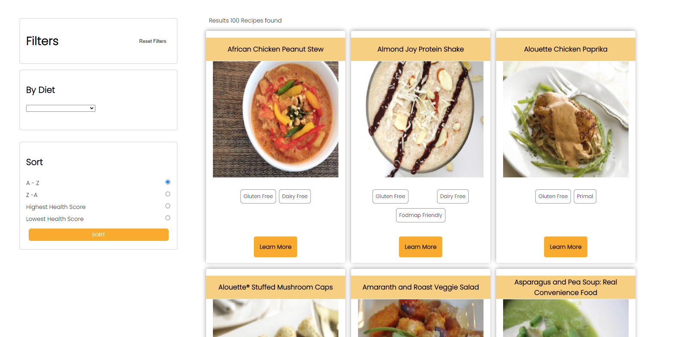
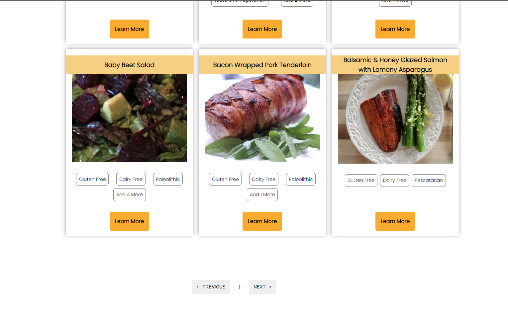
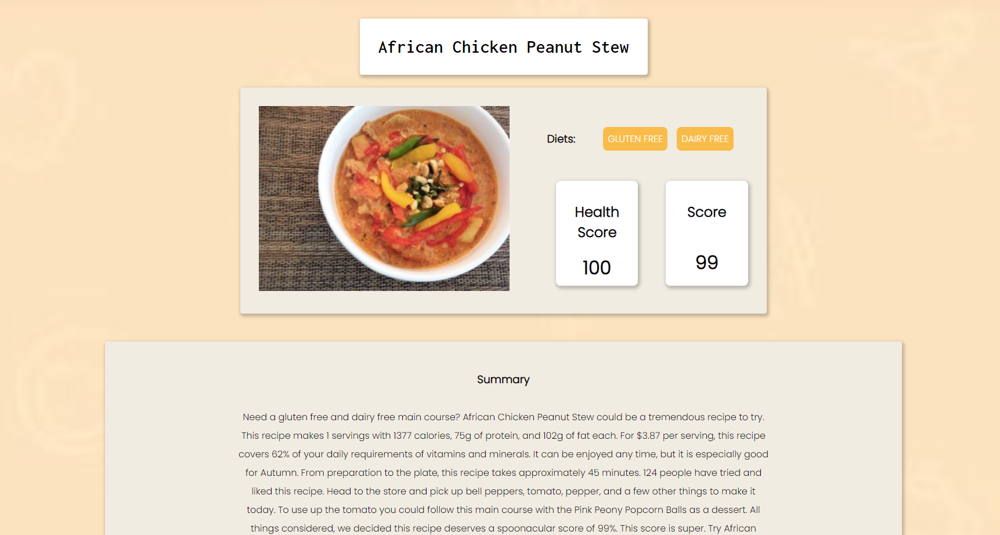
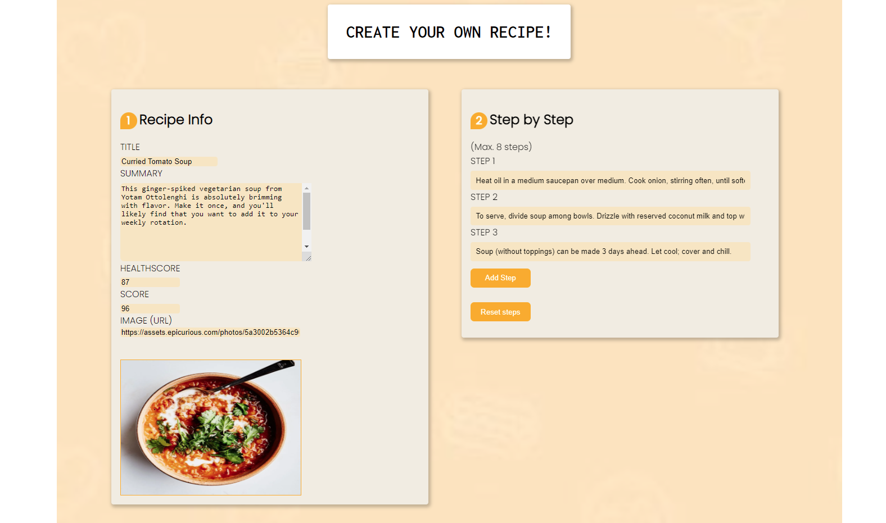
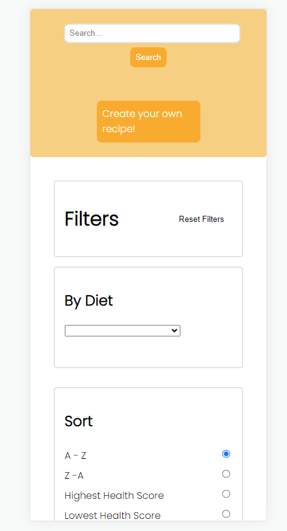
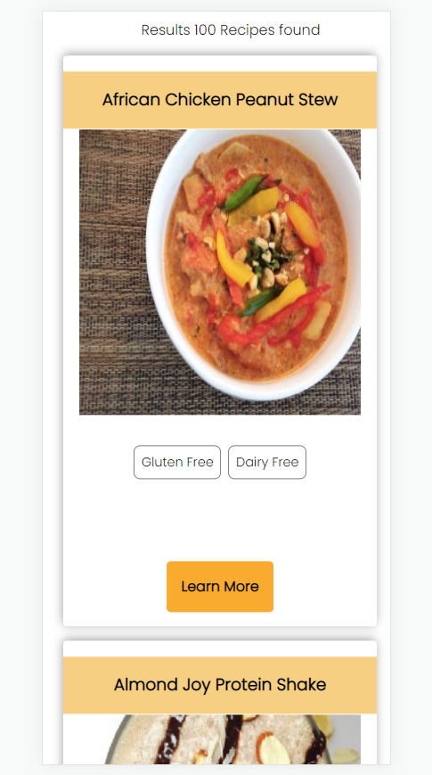
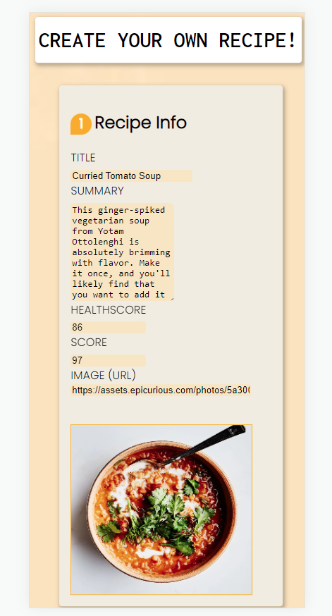
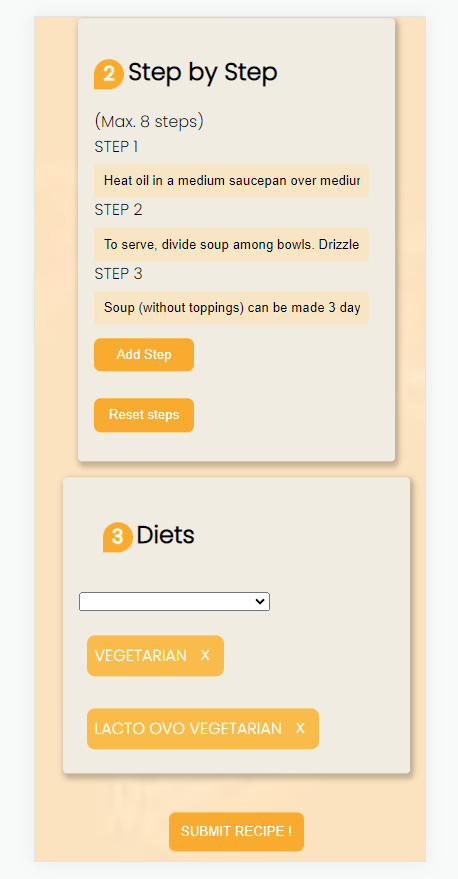

# My Recipes


My Recipes is a Fully-Responsive React application that interacts with the [Spoonacular API](https://spoonacular.com/food-api) that has +5000 recipes. It also works with PostgreSQL and sequelize ORM to save the user's recipes.


 ## Key Features

- Single Page Application

- Filter through the API's recipes or the database recipes

- SearchBar

- Pagination

- Controlled form for creating your own recipes

- Integration testing with Jest and Mocha

## Desktop Views


<div>
 <h3>Recipes</h3>
 

  <h3>Recipe Detail</h3>

 <h3>Create Form</h3>

 </div>
 
 
## Mobile Views

<div>
 <h3>Recipes</h3>
 

 
 <h3>Create Form</h3>

 
 </div>
 
## How to use

In the api folder, you will find an .envsample like this 

    DB_USER=
    DB_PASSWORD=
    DB_HOST=
    YOUR_API_KEY=
    
Create a .env file in the api folder with your postgreSQL credentials and your API key ([Create one here!](https://spoonacular.com/food-api)). Also, you will need to create a database called "food".

To clone and run this application, you'll need [Git](https://git-scm.com/) and [Node.js](https://nodejs.org/en/download/) (which comes with [npm](http://npmjs.com/)) installed on your computer. From your command line:

```bash

# Clone this repository

$ git clone https://github.com/brianweidl/PI-Food-FT21.git

# Go into the api folder

$ cd api

# Install dependencies

$ npm install

# Run the backend

$ npm start

# Open new terminal

$ cd client

# Install dependencies

$ npm install

# Run the frontend

$ npm start

```


<p align="right">
  
</p>
